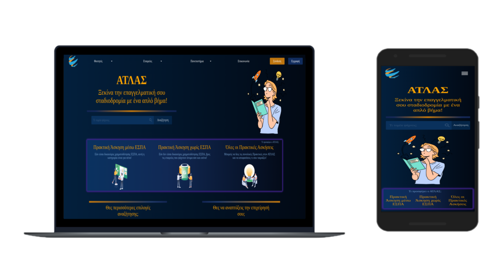

# atlas
Πρόταση επανασχεδιασμού του [ΑΤΛΑΣ](https://atlas.grnet.gr/) στα πλαίσια του μαθήματος Επικοινωνία Ανθρώπου Μηχανής

## Προαπαιτούμενα
    mysql, Java 17 ή ανώτερη, nodejs

## Εγκατάσταση

### Βάση
Για χρήστη `eam` με κωδικό `EAM2022-2023`, ή αλλαγή των `backened/atlas/src/main/resources/application.properties`
    
    cd backened/atlas/src/main/resources/database
    mysql -u eam -p
    EAM2022-2023
    source sdi1600269.sql;

    ή import το script στο xampp

### Backend
    cd backened/atlas
    ./gradlew bootRun

    ή με οποιονδήποτε editor

### Frontend
για εγκατάσταση dependencies μία φορά

    cd frontend/atlas
    npm install

για τρέξιμο

    npm start

Ας τρέχει και το backend ταυτόχρονα.

## Δοκιμαστικοί χρήστες
Κωδικοί `1234`
    
    - Φοιτητές dberos και pcharalampous @atlas.com
    - Εταιρείες mroussou και akolovou @eam.com

